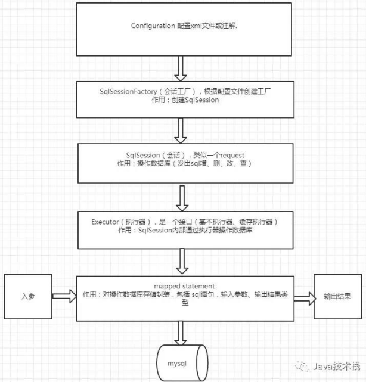

# zdn-mybatis
手动实现一个Mybatis
---
>From Java技术栈公众号

## Mybatis 框架核心

### 几个比较重要的概念
* Configuration 全局配置文件
   * properties 属性
   * settings 设置
   * typeAliases 类型别名
   * typeHandlers 类型处理器
   * environments 环境
   * mappers 映射器
   
* SqlSessionFactory 
    * 负责生产SqlSession
    
* SqlSession
    * 面对程序员的接口,api有针对数据库增删改查的操作,
    还有一个重要的是getMapper(),获取动态代理实现的Mapper。
    
* Excutor
    * 负责对JDBC的模版代码进行一层封装,以及对一二级缓存的操作
    
* Mapper Statement
    * 对输入参数,和返回的结果集进行映射。     
    

